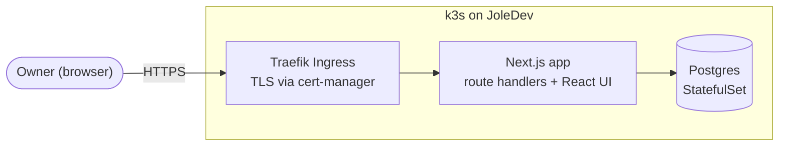
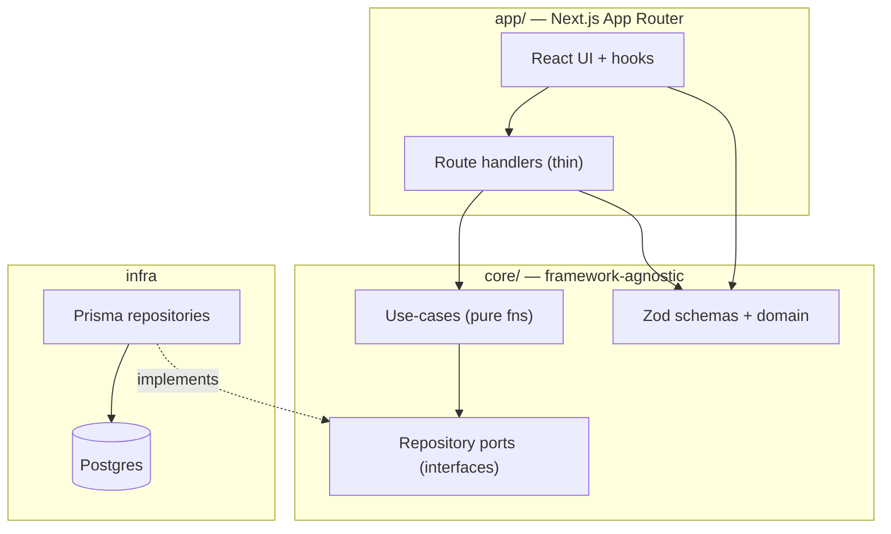
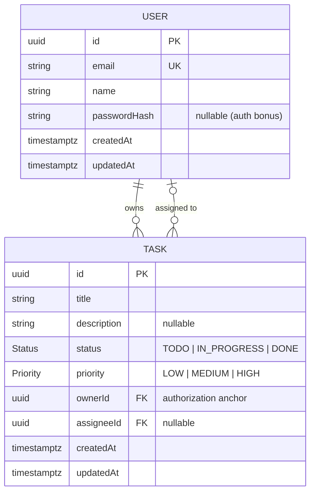
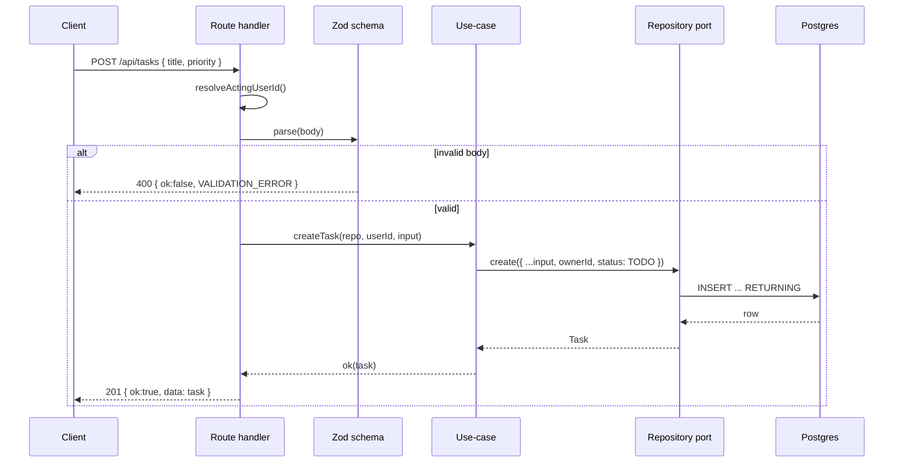
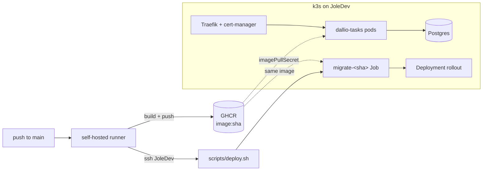

# Architecture

Dallio Tasks is a task manager: owners create tasks, filter/sort/paginate them, and
assign them to users, over a REST API with a React front end. Two entities
(`User`, `Task`), a handful of endpoints, one owner in Fase 1. This document is the
three-minute tour; the _why_ behind each call lives in `DECISIONS.md`.

## Containers

One deployable: a Next.js App Router server that serves both the UI and the JSON API,
talking to Postgres through Prisma. Traefik terminates TLS at the edge.

## Layers

Two layers, one seam. `core/` is framework-agnostic (no `next`/`react`/`prisma-client`
in use-cases); `app/` is a thin Next.js adapter. The **repository port** is the
deliberate inversion point, and an ESLint boundary rule makes the layering provable —
`app/` cannot import a `*-prisma-repository` or `@prisma/client` directly.

Dependencies point inward: `app → core ← infra`. Use-cases depend on the port
_interface_, never on Prisma; the Prisma repository implements it and is wired at a
single composition root (`core/*/container.ts`). Tests substitute an in-memory
repository for the same port — no DB, no browser.

## Data model

Real foreign keys, native enums, `Timestamptz` in UTC — no denormalized user copies.
`Task.ownerId` (`onDelete: Cascade`) is the authorization anchor; `Task.assigneeId`
(`onDelete: SetNull`) is assignment. Composite indexes `(ownerId, createdAt)` and
`(ownerId, status)` back the default owner-scoped list and status filter. `status`
defaults to `TODO` both at the DB and, authoritatively, in the use-case.

## Request flow

Every write follows the same path: parse → validate → use-case → port → envelope. The
route handler holds zero business rules — it resolves identity, validates, and delegates.

Identity (`ownerId`) and server-set fields (`status`) are injected by the use-case,
never read from the body. Unhandled throws are caught at the handler edge, logged as a
scrubbed shape, and returned as a generic `INTERNAL` — no stack or DB detail leaks.

## Deploy topology

CD builds a multi-stage image (`output: 'standalone'`), pushes it to GHCR tagged by
commit SHA, then SSHes to the k3s host and runs Kustomize (base + prod overlay). No
`6443` is exposed and no cluster-admin kubeconfig is shipped. Migrations are a gated
pre-rollout step: a per-SHA `Job` runs `prisma migrate deploy`, `kubectl wait`s for
completion, then the app rolls out — rollout is undone on failure. TLS is issued and
renewed by cert-manager (`letsencrypt-prod`). Vercel + Neon is the always-up fallback
for review day.

## SOLID, right-sized

| Principle | Where it lands | |
|---|---|---|
| **SRP** | Leaned on | Schema validates, use-case decides, repository persists, handler adapts — one reason to change each. |
| **DIP** | Leaned on | Use-cases depend on the `TaskRepository`/`UserRepository` interface; Prisma is injected at the composition root. |
| **ISP** | Applied | Separate `TaskRepository` and `UserRepository` ports — no god-repo; clients see only the methods they use. |
| **OCP** | Not forced | No strategy/plugin scaffolding for 3 filter fields. A new filter is a small, honest edit, not an "extension point." |
| **LSP** | Trivial | Only two implementers per port (Prisma + in-memory), both honoring the same contract; nothing to contort. |

The restraint is the point: forcing OCP/LSP ceremony onto two entities would be exactly
the over-engineering the brief warns against.

## Security model

- **Authorization / IDOR.** Every task addressed by id filters
  `WHERE id = :id AND ownerId = :actingUserId` _in the query_ (`findFirst` /
  `updateMany` / `deleteMany`), never as a post-fetch check. A wrong owner and a
  nonexistent id are indistinguishable — both return **404**, so there's no existence
  oracle. `assignTask` confirms task ownership before probing the assignee, closing the
  user-enumeration side channel.
- **Injection.** Filtering/sorting/paging run as parameterized SQL through Prisma. Sort
  is the one identifier Prisma can't parameterize, so incoming `sort` is mapped through a
  fixed allowlist record (`{ createdAt, priority, status, title }`) after Zod has already
  restricted it to that set; unknown → default. `dir` is a Zod enum.
- **Input.** Zod at every trust boundary (route handlers and any future Server Action).
  Identity and server-set fields are derived server-side, never trusted from the body.
- **Logging.** `pino` with a redaction allowlist (`authorization`, `cookie`,
  `set-cookie`, `*.password`, `*.passwordHash`, `*.token`, `DATABASE_URL`); no full
  request/response bodies; errors log a scrubbed `{ name, code }` only.
- **Secrets out-of-band.** Only `.env.example` and `secret.example.yaml` are committed.
  Real k8s Secrets are created with `kubectl create secret`; nothing sensitive is baked
  into the image. Containers run non-root with a read-only root filesystem and all
  capabilities dropped.

## Stack

Next.js 15 (App Router, `standalone`) · React 19 · TypeScript strict · Prisma 6 +
Postgres 16 · Zod · TanStack Query + React Hook Form · shadcn/Radix · pino · Vitest ·
Docker → GHCR → k3s (Kustomize, Traefik, cert-manager).
